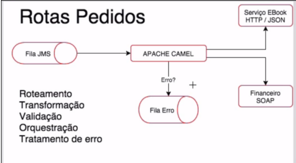
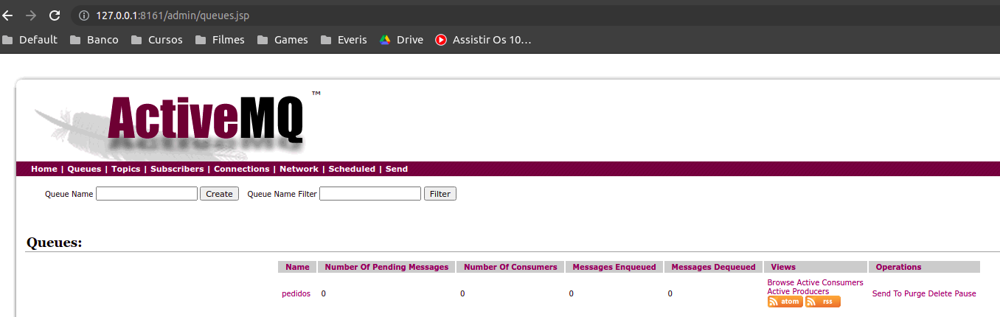
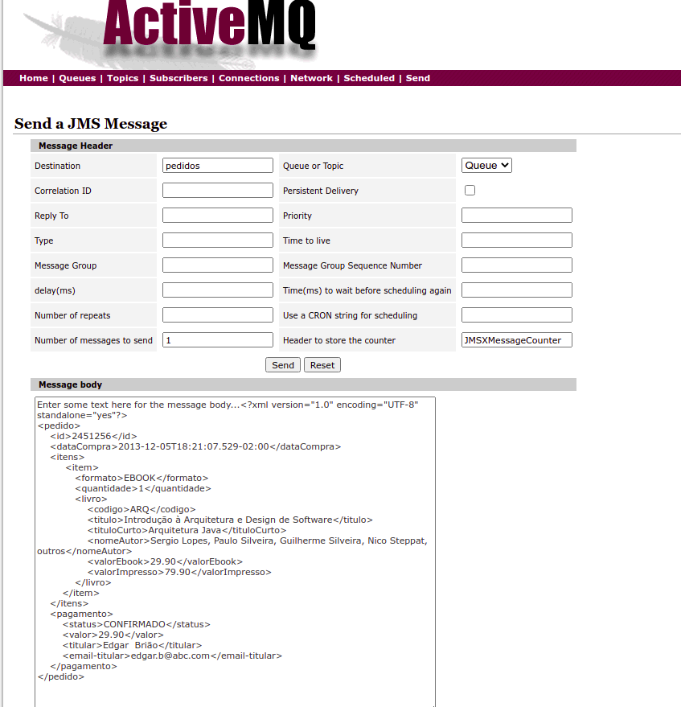
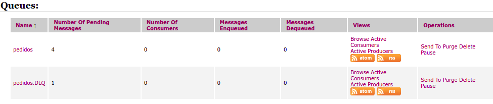
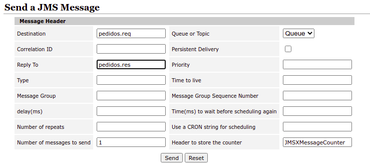
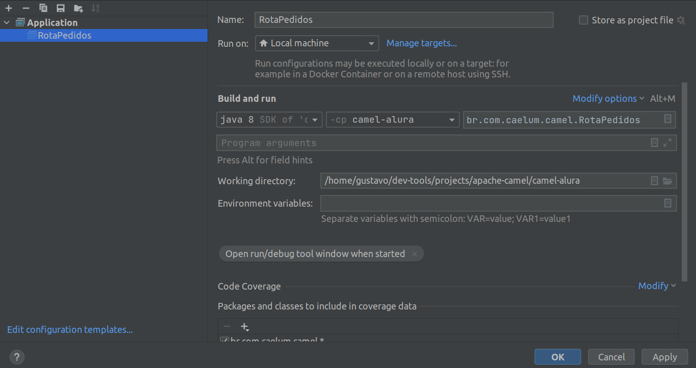
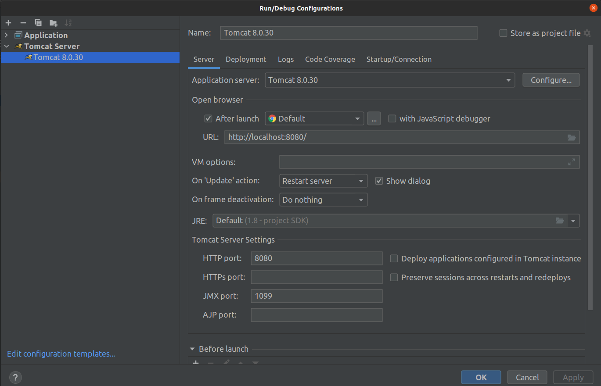
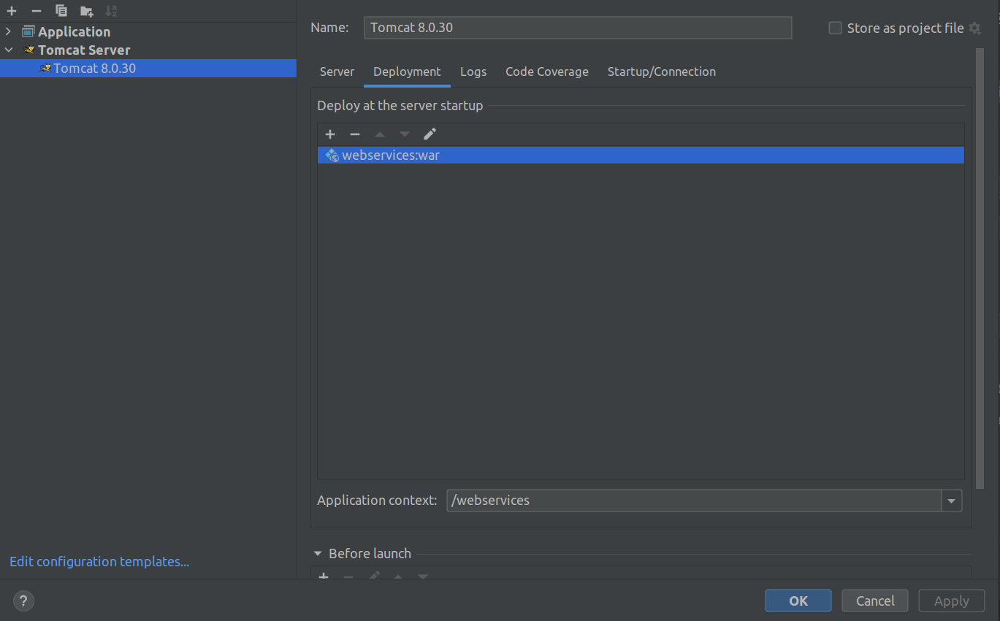

# Apache Camel:.

## Sobre

````
camel-alura e webservices - Projeto Maven

camel-alura - Exemplos de chamadas Camel
apache-activemq-5.16.2 - Filas JMS
apache-tomcat-8.0.30 - Servidor Tomcat que sobe o projeto webservices
webservices - Projeto com as URLS:
http://localhost:8080/webservices/financeiro - SOAP
http://localhost:8080/webservices/ebook/item - Rest API
camel-spring-boot-projeto - Spring Boot que sob o Camel basico

Framework de integração, seguimos boas práticas 
que foram identificadas e descritas nos padrões de integração.

Apache Camel é um framework Java de código aberto que tenta deixar a integração 
mais simples e acessível para todos os desenvolvedores. 
Ele faz isso através de:

Implementações concretas dos padrões de integração (EIP)
Conectividade com uma grande variedade de protocolos e APIs
Uso de uma Domain Specific Languages (DSLs) para amarrar os EIPs e protocolos

Máquina de roteamento. Camel DSL.
From - de onde vem
To - para onde vai

XSD - Defina as regras do pojo

https://camel.apache.org/components/latest/
http://www.soapui.org/downloads/soapui/open-source.html
````

## Instalar

````
MySQL no Docker
docker run --name database-mysql --network host -e MYSQL_ROOT_PASSWORD=root -d mysql:latest

CREATE DATABASE camel;
USE camel;

CREATE TABLE negociacao
(
    id         BIGINT NOT NULL AUTO_INCREMENT,
    preco      DECIMAL(5, 2),
    quantidade MEDIUMINT,
    data       DATETIME,
    PRIMARY KEY (id)
);
````



## JMS

````
cd apache-activemq-5.16.2/bin
sh activemq console
http://127.0.0.1:8161/index.html
````




````
Mensagem na fila esperando
````



````
Para receber a resposta
````



### Iniciando o Apache Camel



### Webservice


